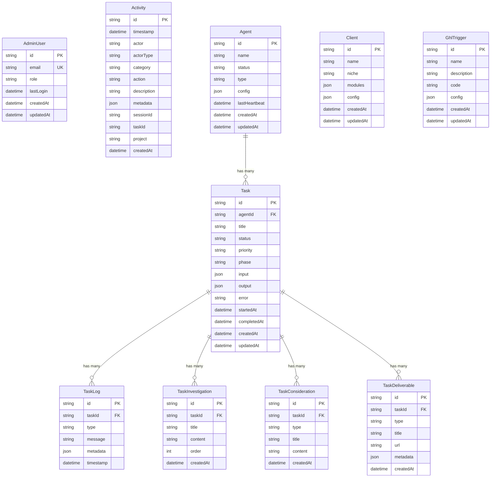

# Migrate Firebase to Supabase (PostgreSQL + Prisma)

## Overview

Replace Firebase/Firestore with Supabase (PostgreSQL + Prisma ORM) as the data layer for the parnellsystems-platform internal systems app. Migrate incrementally — collection by collection — with feature flags to validate at each step.

## Problem Statement

- Firebase project (`awe2m8-sales`) is tied to the old awe2m8 Google account
- Firestore is expensive and hard to query (client-side filtering, no JOINs, composite index requirements)
- CLAUDE.md already identifies this as the priority migration
- Phase 1 (repo rename, domain, Google Workspace) is complete — now is the right time

## Architecture Decisions

### What stays
- **NextAuth v5** — remains the sole auth provider (Google OAuth)
- **Existing API route structure** — API routes become Prisma-backed instead of Firebase-backed

### What changes
- **Firestore** → **PostgreSQL** (via Supabase hosted DB)
- **Firebase Admin SDK** → **Prisma ORM** (server-side CRUD)
- **Firebase Client SDK** → **Supabase JS Client** (Realtime subscriptions only)
- **Firebase Anonymous Auth** → removed (Supabase Realtime with RLS replaces this)
- **onSnapshot listeners** → **Supabase Realtime** (`postgres_changes` over WebSocket)

### Key principle: Prisma for CRUD, Supabase JS for Realtime only
- Prisma connects directly to PostgreSQL (server-side, bypasses RLS)
- Supabase JS client used only in browser hooks for real-time subscriptions
- Writes go through Prisma → PostgreSQL WAL → Supabase Realtime broadcasts to subscribers automatically

---

## Database Schema (ERD)



---

## Execution Plan (wave-execute format)

### Wave 1 — Supabase Project Setup + Prisma Foundation

**Step 1.1 — Create Supabase project**
1. Go to https://supabase.com/dashboard
2. Create new project under parnellsystems org
3. Choose region closest to your Vercel deployment
4. Note down: Project URL, anon key, service role key
5. Go to Project Settings → Database → Connection strings
6. Note the pooled connection string (port 6543) and direct connection (port 5432)

**Step 1.2 — Create dedicated Prisma database user**
Run in Supabase SQL Editor:
```sql
CREATE USER "prisma" WITH PASSWORD '<STRONG_PASSWORD>' BYPASSRLS CREATEDB;
GRANT "prisma" TO "postgres";
GRANT USAGE ON SCHEMA public TO prisma;
GRANT CREATE ON SCHEMA public TO prisma;
GRANT ALL ON ALL TABLES IN SCHEMA public TO prisma;
GRANT ALL ON ALL ROUTINES IN SCHEMA public TO prisma;
GRANT ALL ON ALL SEQUENCES IN SCHEMA public TO prisma;
ALTER DEFAULT PRIVILEGES FOR ROLE postgres IN SCHEMA public
  GRANT ALL ON TABLES TO prisma;
ALTER DEFAULT PRIVILEGES FOR ROLE postgres IN SCHEMA public
  GRANT ALL ON ROUTINES TO prisma;
ALTER DEFAULT PRIVILEGES FOR ROLE postgres IN SCHEMA public
  GRANT ALL ON SEQUENCES TO prisma;
```

**Step 1.3 — Install dependencies**
```bash
npm install @supabase/supabase-js @supabase/ssr prisma @prisma/client
npm install -D @types/pg
npx prisma init
```

**Step 1.4 — Configure environment variables**
Add to `.env.local`:
```
# Supabase
NEXT_PUBLIC_SUPABASE_URL=https://<project-ref>.supabase.co
NEXT_PUBLIC_SUPABASE_PUBLISHABLE_KEY=<anon-key>
SUPABASE_SERVICE_ROLE_KEY=<service-role-key>

# Prisma
DATABASE_URL="postgresql://prisma.<project-ref>:<password>@<region>.pooler.supabase.com:6543/postgres?pgbouncer=true"
DIRECT_URL="postgresql://prisma.<project-ref>:<password>@<region>.pooler.supabase.com:5432/postgres"
```
Add same vars to Vercel Environment Variables (Production + Preview).

**Step 1.5 — Create Prisma schema with AdminUser model**

File: `prisma/schema.prisma`
```prisma
datasource db {
  provider  = "postgresql"
  url       = env("DATABASE_URL")
  directUrl = env("DIRECT_URL")
}

generator client {
  provider = "prisma-client-js"
}

model AdminUser {
  id        String   @id @default(cuid())
  email     String   @unique
  role      String   @default("admin")
  lastLogin DateTime? @map("last_login")
  createdAt DateTime  @default(now()) @map("created_at")
  updatedAt DateTime  @updatedAt @map("updated_at")

  @@map("admin_users")
}
```

**Step 1.6 — Create Prisma client singleton**

File: `src/lib/prisma.ts`
```typescript
import { PrismaClient } from '@prisma/client'

const globalForPrisma = globalThis as unknown as { prisma: PrismaClient }

export const prisma = globalForPrisma.prisma ?? new PrismaClient()

if (process.env.NODE_ENV !== 'production') globalForPrisma.prisma = prisma
```

**Step 1.7 — Create Supabase client helpers**

File: `src/lib/supabase/client.ts` (browser — for Realtime only)
File: `src/lib/supabase/server.ts` (server — if needed later)

**Step 1.8 — Run first migration**
```bash
npx prisma migrate dev --name init-admin-users
npx prisma generate
```

**Validate:** `npx prisma studio` — verify AdminUser table exists in Supabase.

---

### Wave 2 — Migrate AdminUser + Auth (highest value, validates the pattern)

**Why first:** This is the simplest collection (flat, ~2-5 records), and it validates the entire Prisma pipeline including auth. Once this works, you know the foundation is solid.

**Step 2.1 — Seed admin users into Supabase**
Write a script to seed admin users (including `giles@parnellsystems.com` and `giles@awe2m8.ai`):
```bash
npx tsx scripts/seed-admin-users.ts
```

**Step 2.2 — Replace Firebase admin functions with Prisma**

Update `src/lib/firebase-admin.ts` exports — create a new `src/lib/admin-users.ts` with Prisma equivalents:
- `isAdminEmail(email)` → `prisma.adminUser.findUnique({ where: { email } })`
- `getAdminUser(email)` → same
- `addAdminUser(data)` → `prisma.adminUser.create({ data })`
- `listAdminUsers()` → `prisma.adminUser.findMany()`
- `deleteAdminUser(email)` → `prisma.adminUser.delete({ where: { email } })`
- `updateLastLogin(email)` → `prisma.adminUser.update({ where: { email }, data: { lastLogin: new Date() } })`

**Step 2.3 — Update auth.ts to use Prisma instead of Firebase Admin**
Replace imports from `firebase-admin` with imports from the new `admin-users.ts`.

**Step 2.4 — Update API route `/api/admin/users/route.ts`**
Switch from Firebase Admin SDK to Prisma calls.

**Step 2.5 — Remove `createFirebaseCustomToken` and Firebase Auth dependency**
The custom token flow was only needed to bridge NextAuth → Firebase client auth. With Supabase, this is no longer needed.

**Validate:**
1. `npm run dev` — app starts without errors
2. Visit `http://localhost:3000/login` — Google OAuth login works
3. Visit `/admin` — admin dashboard loads
4. Test admin user CRUD in the admin panel

---

### Wave 3 — Migrate Activities (largest collection, validates Realtime)

**Step 3.1 — Add Activity model to Prisma schema**
```prisma
model Activity {
  id          String   @id @default(cuid())
  timestamp   DateTime @default(now())
  actor       String
  actorType   String   @default("main") @map("actor_type")
  category    String
  action      String
  description String
  metadata    Json     @default("{}")
  sessionId   String?  @map("session_id")
  taskId      String?  @map("task_id")
  project     String?
  createdAt   DateTime @default(now()) @map("created_at")

  @@index([timestamp(sort: Desc)])
  @@index([category])
  @@index([taskId])
  @@map("activities")
}
```

Run: `npx prisma migrate dev --name add-activities`

**Step 3.2 — Enable Supabase Realtime on activities table**
```sql
ALTER PUBLICATION supabase_realtime ADD TABLE activities;
ALTER TABLE activities REPLICA IDENTITY FULL;
```

**Step 3.3 — Set up RLS for public read access**
```sql
ALTER TABLE public.activities ENABLE ROW LEVEL SECURITY;

CREATE POLICY "Activities are publicly readable"
  ON public.activities FOR SELECT USING (true);
```

**Step 3.4 — Write data migration script**
`scripts/migrate-activities.ts` — batch-export from Firestore, upsert into PostgreSQL via Prisma. Use cursor-based pagination with `startAfter()`.

**Step 3.5 — Replace activity API routes with Prisma**
- `src/app/api/activities/route.ts` — switch to Prisma queries
- `src/lib/activity-logger-server.ts` — write to Prisma instead of Firestore
- `src/lib/firebase-activity-logger.ts` — replace with Prisma-based logger

**Step 3.6 — Replace `useActivityFeed` hook with Supabase Realtime**
- Fetch initial data via API route (Prisma)
- Subscribe to `postgres_changes` on `activities` table for live updates
- Remove Firestore `onSnapshot` and client-side 3x over-fetching (PostgreSQL handles server-side filtering properly)

**Step 3.7 — Update `/api/costs/route.ts`**
Cost data is aggregated from activities — update to query via Prisma.

**Validate:**
1. Activity feed loads on Mission Control dashboard
2. New activities appear in real-time
3. Cost tracking page shows correct data
4. Run `scripts/migrate-activities.ts` and verify record counts match Firestore

---

### Wave 4 — Migrate Agents + Tasks (complex, has sub-collections)

**Step 4.1 — Add Agent, Task, and sub-collection models to Prisma schema**
- Agent, Task, TaskLog, TaskInvestigation, TaskConsideration, TaskDeliverable
- Foreign keys: Task → Agent, TaskLog/Investigation/Consideration/Deliverable → Task
- Run: `npx prisma migrate dev --name add-agents-tasks`

**Step 4.2 — Enable Realtime on agents and tasks tables**
```sql
ALTER PUBLICATION supabase_realtime ADD TABLE agents;
ALTER PUBLICATION supabase_realtime ADD TABLE tasks;
ALTER TABLE agents REPLICA IDENTITY FULL;
ALTER TABLE tasks REPLICA IDENTITY FULL;
```

**Step 4.3 — Set up RLS policies**
Same pattern as activities — public read, authenticated write (or no client-side writes if all writes go through API routes).

**Step 4.4 — Write migration scripts**
- `scripts/migrate-agents.ts`
- `scripts/migrate-tasks.ts` (including sub-collections: logs, investigations, considerations, deliverables)

**Step 4.5 — Replace agent/task API routes with Prisma**
- `src/app/api/agents/route.ts`
- `src/app/api/agents/heartbeat/route.ts`

**Step 4.6 — Replace hooks with Supabase Realtime**
- `src/hooks/useAgents.ts` — agent status + task list
- `src/hooks/useAgentTasks.ts` — task details with sub-collection data
- `src/hooks/useInvestigations.ts`
- `src/hooks/useCalendar.ts` (if it reads from tasks)

**Step 4.7 — Update Mission Control components**
- `src/components/mission-control/AgentStrip.ts` — switch from Firestore to Supabase Realtime

**Validate:**
1. Mission Control shows agents with live status updates
2. Task board loads with all sub-collection data (logs, investigations, etc.)
3. Agent heartbeat updates propagate in real-time
4. Record counts match Firestore

---

### Wave 5 — Migrate Clients + GHL Triggers (smaller collections)

**Step 5.1 — Add Client and GhlTrigger models to Prisma schema**
Run: `npx prisma migrate dev --name add-clients-ghl-triggers`

**Step 5.2 — Write migration scripts**
- `scripts/migrate-clients.ts`
- `scripts/migrate-ghl-triggers.ts`

**Step 5.3 — Replace data access**
- `src/hooks/useAdminState.ts` — client CRUD via Prisma API routes
- `src/app/ghl-triggers/[id]/page.tsx` — read from Prisma instead of Firestore

**Validate:**
1. Client configuration page works (list, create, edit, delete)
2. GHL trigger pages load correctly
3. Demo pages using client data still render

---

### Wave 6 — Remove Firebase + Cleanup

**Step 6.1 — Remove Firebase Anonymous Auth**
- Delete `src/hooks/useFirebaseAuth.ts`
- Remove anonymous auth from `src/components/auth/AuthProvider.tsx`
- Remove `/api/auth/firebase-token/route.ts`

**Step 6.2 — Delete Firebase files**
- `src/lib/firebase.ts`
- `src/lib/firebase-admin.ts`
- `src/lib/firebase-activity-logger.ts`
- `firebase.json`
- `firestore.rules`
- `twilio_config.json` (if Firebase-related)
- `scripts/seed-firebase.js`
- `scripts/test-firebase.js`
- `scripts/check-firebase.js`

**Step 6.3 — Remove Firebase packages**
```bash
npm uninstall firebase firebase-admin
```

**Step 6.4 — Remove Firebase environment variables**
From `.env.local` and Vercel:
- All `NEXT_PUBLIC_FIREBASE_*` vars
- All `FIREBASE_ADMIN_*` vars

**Step 6.5 — Update CLAUDE.md**
- Remove Firebase references from tech stack
- Add Supabase + Prisma to tech stack
- Update project structure
- Update "Things to Never Do" (replace Firebase rules with Prisma rules)
- Update environment variables section

**Step 6.6 — Update middleware.ts if needed**
Remove any Firebase-related middleware logic.

**Validate:**
1. `npm run build` — no Firebase imports remain
2. `npm run test` — all tests pass
3. Full app walkthrough: login → admin dashboard → Mission Control → activity feed → agent status
4. Verify no `firebase` or `firebase-admin` in `node_modules` after clean install

---

## Migration Order Summary

| Wave | Collection(s) | Files Changed | Validates |
|------|--------------|---------------|-----------|
| 1 | (setup) | prisma.ts, supabase clients, schema | Prisma ↔ Supabase connection |
| 2 | admin_users | auth.ts, admin API route | Auth + Prisma CRUD |
| 3 | activities | activity hooks, API routes, loggers | Realtime subscriptions + large dataset |
| 4 | agents, tasks + sub-collections | agent/task hooks, API routes, Mission Control | Complex relations + Realtime |
| 5 | clients, ghl_triggers | admin state hook, GHL pages | Remaining collections |
| 6 | (cleanup) | Remove all Firebase code | Zero Firebase dependency |

## Dependencies & Risks

**Dependencies:**
- Supabase account and project (free tier sufficient for single-user internal app)
- DNS/network access to Supabase from Vercel

**Risks:**
- **Realtime latency increase:** Supabase Realtime is ~500ms vs Firestore's ~100ms. Acceptable for internal dashboard.
- **No initial snapshot:** Unlike Firestore `onSnapshot`, Supabase Realtime doesn't deliver initial data. Must fetch separately via API route.
- **Firestore flexible schema:** Some documents may have inconsistent fields. Migration scripts must handle missing/extra fields gracefully.
- **Data loss during migration:** Mitigated by keeping Firebase active until Wave 6 is validated.

## Rollback

Each wave can be rolled back independently:
- Revert the code changes (git)
- Firebase remains the source of truth until Wave 6
- Feature flags (environment variables) can switch individual collections back to Firebase if needed

## Acceptance Criteria

- [ ] All 12 Firestore collections migrated to PostgreSQL tables
- [ ] Auth works via NextAuth + Prisma (no Firebase dependency)
- [ ] Real-time updates work on Mission Control via Supabase Realtime
- [ ] Activity feed, agent status, task board all functional
- [ ] `firebase` and `firebase-admin` removed from package.json
- [ ] All Firebase config files deleted
- [ ] CLAUDE.md updated to reflect new stack
- [ ] Zero references to Firebase in application code (docs/content excluded)
- [ ] `npm run build` passes cleanly
- [ ] All existing tests pass or are updated
